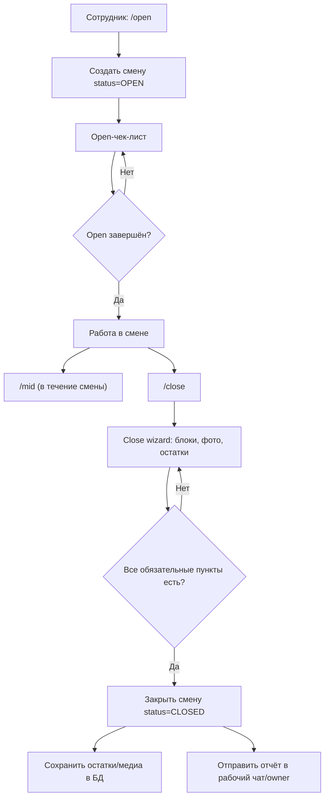
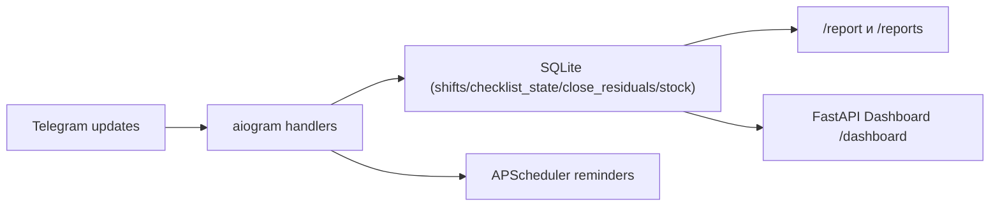
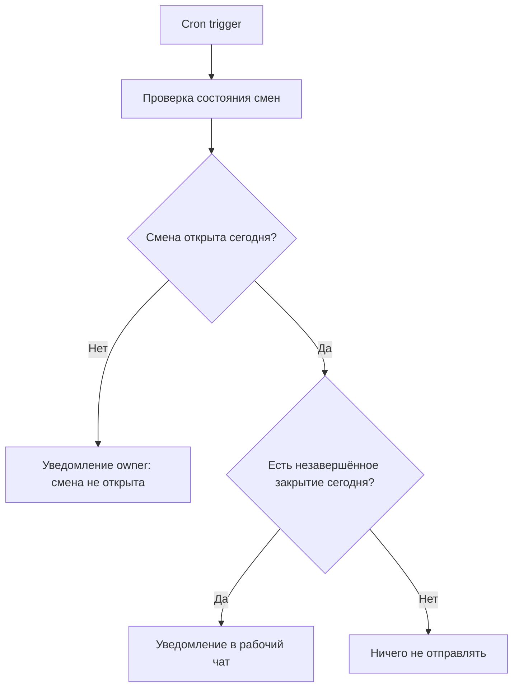

# Durum Bot

Telegram-бот для управления сменами дюрюмной: чек-листы, закрытие смены, фиксация остатков и отчёты.  
В проекте есть аналитический веб-дашборд `/dashboard` (FastAPI + Jinja2 + Chart.js) для KPI, аномалий и контроля потерь.

## 0. Ветки

- `dev` — рабочая ветка для разработки.
- `master` — основная ветка.

## 1. Описание проекта

Что решает бот:
- ведёт сотрудника по чек-листам открытия, ведения и закрытия смены;
- фиксирует остатки при закрытии и сохраняет их в SQLite;
- формирует отчёты по дате и интерактивные отчёты через `/reports`;
- отправляет рабочие уведомления и напоминания.

## 1.1 Интуиция Продукта (Визуально)

### Что является центром логики

`Смена` — главная сущность продукта.  
Всё остальное привязано к конкретной смене:
- open/mid/close чек-листы;
- остатки и фото при закрытии;
- уведомления и отчёты.

### Сквозной пользовательский сценарий



### Внутренняя логика сервиса



### Логика напоминаний (для продакта)



Важно: напоминание `Смена ещё не закрыта` считается только по активным сменам текущей даты.

## 2. Как запустить

### Вариант A: Docker Compose

```bash
docker compose up --build
```

Если изменили `.env`, пересоздайте контейнеры, чтобы переменные точно применились:

```bash
docker compose up -d --force-recreate
```

После запуска:
- бот работает в контейнере `bot`;
- веб-дашборд доступен на `http://localhost:8000/dashboard`.

Данные и логи:
- база: `./data/shifts.db`
- логи: `./logs/app_YYYY-MM-DD.log`

### Вариант B: локально через Poetry

```bash
poetry install
poetry run python -m app.bot
```

Дашборд локально:

```bash
poetry run python -m uvicorn app.dashboard:app --host 0.0.0.0 --port 8000
```

### Настройка `.env`

```bash
cp .env.example .env
```

Минимально заполните:

```env
BOT_TOKEN=
OWNER_ID=
WORK_CHAT_ID=
DB_PATH=data/shifts.db
LOG_DIR=logs
BOT_TIMEZONE=Europe/Moscow
SHIFT_OPEN_TIME=11:00
SHIFT_CLOSE_TIME=22:00
```

## 3. Структура проекта

```text
app/
  bot.py                 # Точка входа Telegram-бота
  config.py              # Загрузка и валидация настроек
  db.py                  # SQLite-слой и миграции
  db_schema.py           # Отдельные миграции/синхронизация схемы
  report_builder.py      # Текстовый отчёт /report YYYY-MM-DD
  reminders.py           # Планировщик напоминаний
  logging_setup.py       # Логирование в daily-файлы
  units_config.py        # Базовые единицы измерения и нормализация
  checklist/
    callbacks.py         # Формирование и парсинг callback_data чек-листов
    config.yaml          # YAML-конфиг чек-листов и остатков
    data.py              # Загрузка/валидация checklist-конфига
    ui.py                # Рендер текста/клавиатур чек-листов
  dashboard/
    __init__.py          # Экспорт FastAPI app для uvicorn app.dashboard:app
    web.py               # FastAPI роуты и миграции для dashboard
    service.py           # Агрегация KPI/аномалий/аналитики
    templates/           # Jinja2-шаблоны (base/dashboard)
    static/              # CSS и JS дашборда
  handlers/
    __init__.py          # Сборка всех роутеров
    shift.py             # /open, /mid, /close и чек-листы
    shift_checklist.py   # Callback-обработчики open/mid чек-листов
    stock.py             # /stock
    misc.py              # /start, /cancel, /problem, /report
    reports.py           # /reports (интерактивные отчёты)
    states.py            # FSM-состояния
    constants.py         # Константы сценариев
    utils.py             # Вспомогательные функции
docs/
  architecture.md        # Схема логики и архитектуры
Dockerfile
docker-compose.yml
pyproject.toml
```

## 4. Используемые технологии

- Python 3.13
- aiogram 3.x
- SQLite
- APScheduler
- FastAPI + Uvicorn
- Jinja2 Templates
- PyYAML
- Chart.js
- Poetry
- Docker / Docker Compose

## 5. Основные команды бота

- `/start` — показать главное меню
- `/open` — открыть смену и пройти чек-лист открытия
- `/mid` — чек-лист ведения смены
- `/close` — чек-лист закрытия + фиксация остатков
- `/stock` — ручной ввод остатков
- `/problem` — отправка проблемы владельцу
- `/report YYYY-MM-DD` — текстовый отчёт за дату
- `/reports` — интерактивные отчёты (смены/остатки/чек-листы)
- `/cancel` — сброс текущего FSM-сценария

Текущее reply-меню первого уровня:
- при закрытой смене: `▶ Открыть смену`
- при открытой смене: `📝 Ведение смены`, `🔒 Закрыть смену`

## 6. Пример работы

### Смена (типовой поток)

1. Сотрудник отправляет `/open`.
2. Бот показывает чек-лист открытия с прогрессом `X / Y`.
3. После завершения смена фиксируется как `OPEN` (кто открыл, когда открыл).
4. В течение дня сотрудник может проходить `/mid`.
5. В конце дня сотрудник запускает `/close`, вводит остатки и фото.
6. Бот закрывает смену (`CLOSED`), сохраняет остатки и отправляет отчёт в рабочий чат.

### Интерактивные отчёты

1. `/reports`
2. Выбор типа отчёта:
   - отчёт по сменам
   - отчёт по остаткам
   - отчёт по чек-листам
3. Выбор даты
4. Для отчёта по сменам: выбор конкретной смены и просмотр деталей.

## 7. Изменения UI/UX (апрель 2026)

### Дашборд

- **Диапазон дат** — фильтр «С» / «По» вместо одного дня; параметры URL: `?date_from=YYYY-MM-DD&date_to=YYYY-MM-DD`.
- **Подзаголовок периода** — topbar показывает активный диапазон: `Данные за: 01.04.2026 — 05.04.2026` или `Данные за: Все смены`.
- **Цветовая индикация KPI** — карточки «Среднее закрытие» и «Заполнение» подсвечиваются:
  - зелёный — хорошо (закрытие ≤ 20 мин, заполнение ≥ 95%);
  - жёлтый — умеренно (закрытие ≤ 40 мин, заполнение ≥ 75%);
  - красный — требует внимания.
- **Цветные бейджи статуса** — в таблице смен колонка «Статус чек-листа» показывает цветные пилюли: зелёная/жёлтая/синяя.
- **Аномалии остатков** — строки с аномалиями получают красную левую полосу, ячейка отклонения выделяется красным жирным.
- **Sticky-заголовок таблицы смен** — `thead` прилипает при вертикальном скролле.
- **Лайтбокс фотографий** — клик по миниатюре открывает фото в полноэкранном модальном окне; закрытие по кнопке ✕, клику на фон или клавише Escape.

### Telegram-бот

- **Навигация чек-листа** — кнопка `➡` переименована в `Далее →` для симметрии с `← Назад`.
- **Счётчик секций** — в заголовке чек-листа теперь отображается `Блок 2 из 5 — Чистота`.

## 8. Диагностика Типовых Ошибок

- `ClientConnectorError / SSL handshake timeout / ServerDisconnectedError`
  Причина: сетевой доступ до `api.telegram.org` временно недоступен.
  Влияние: часть update/ответов может задерживаться или падать.

- `Bad Request: query is too old`
  Причина: callback-кнопка нажата слишком поздно или после переподключения.
  Влияние: на бизнес-данные не влияет, но давал stack trace в логах.
  Статус: обработка сделана безопасной в callback-сценариях смены.

- `Смена ещё не закрыта` после закрытия
  Историческая причина: в БД могли оставаться старые `OPEN`-смены.
  Текущее поведение: напоминание проверяет активные смены только за текущую дату.

## 9. Логирование

Логирование настроено в файл на каждый день:

```text
logs/app_YYYY-MM-DD.log
```

Логируются ключевые события:
- открытие смены;
- закрытие смены;
- ошибки.
